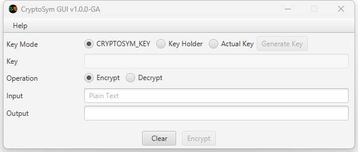

# CryptoSym

A lightweight symmetric encryption implementation.

## KeyResolver Interface

Only the implementation of the KeyResolver interface must be used for resolving a key. This is to have consistency of resolving the key.

The default implementations are as follows:

| Implementation Constructor       | Usage                                                        |
| -------------------------------- | ------------------------------------------------------------ |
| EnvAsKey(String keyHolder)       | Use this if the key is being held in an environment variable. Where the `keyHolder` must be the name of the `environment variable`.  This is useful if the key is held in a custom environment variable *(i.e. not the CRYPTOSYM_KEY)*. |
| EnvAsKeyByProp(String keyHolder) | Use this if a system property is holding the name of the environment variable holding the key. Where the `keyHolder` must be the `system property name`.   This is useful if you don't want to provide the key as a system property *(i.e. not the cryptosym.keyholder)* since the actual key is held in a custom environment variable *(i.e. not the CRYPTOSYM_KEY)*. |
| KeyChain()                       | Use this implementation to find the key using the following sequence: `cryptosym.key property` -> `cryptosym.keyholder property` -> `CRYPTOSYM_KEY` environment variable  This mean the traversal stops to the first one who provided the value. Moreover, this is also the implementation being used when there is no KeyResolver implementation provided to either encrypt or decrypt method. |
| NullKeyResolver()                | The null object implementation of the KeyResolver.           |
| PropAsKey(String keyHolder)      | Use this implementation if the key is being held in a system property. Where the keyHolder is the name of the system property.  This is useful if you want to provide the key as a system property *(i.e. not the cryptosym.key)*. |
| StringAsKey(String key)          | Use this implementation if the actual key known.             |

## KeyChain Class

The KeyChain class is an implementation of KeyResolver interface which probes the actual string key using the following in sequence:

### 1. cryptosym.key property

The `system property` that must hold the actual string key. 

Use the following JVM option syntax:

`-Dcryptosym.key=<STRING_KEY>`

**Example**

`-Dcryptosym.key=BNIu1ypTIMAAtm8nO6aGokH9+WpAPMnfb5GEArhWoAg=`

### 2. cryptosym.keyholder property

The `system property` that must hold the environment variable that holds the actual string key. Use this if CRYPTOSYM_KEY was already in used or you want a totally different environment to hold the actual string key.

Use the following JVM option syntax:

`-Dcryptosym.keyholder=<ENVIRONMENT_VARIABLE>`

**Example**

`-Dcryptosym.keyholder=APP_KEY`

In this example the `APP_KEY` environment variable holds the actual string key.

### 3. CRYPTOSYM_KEY environment variable

The `environment variable` that must hold the actual string key.

> Following the preceding sequence *(i.e. cryptosym.key property -> cryptosym.keyholder property -> CRYPTOSYM_KEY environment variable)*, if any one of these resolves to an actual key string. The probing stops from there. For instance, if cryptosym.key property was resolved to a valid key, the probing stops there. It will not check cryptosym.keyholder property and CRYPTOSYM_KEY environment variable at all. 

> It is not required to use them all at the same time. For instance, if you already CRYPTOSYM_KEY environment variable configured, you don't need to use the other properties *(i.e. cryptosym.key property or cryptosym.keyholder property)*.

## SecretMgr Class

The SecretMgr class is the one that is responsible for generating a key. 

| Method                                | Description                                                  |
| ------------------------------------- | ------------------------------------------------------------ |
| generateKeyAsString() : String        | Generates a key based on AES algorithm of size 256.          |
| generateKeyAsString(String algorithm) | Generates a key based on the the algorithm provided the size will always be 256 in size. |

## CryptoSym Class

The CryptoSym class is the class to use do encryption and decryption.

| Method                                                 | Usage                                                        |
| ------------------------------------------------------ | ------------------------------------------------------------ |
| decrypt(KeyResolver keyResolver, String encryptedText) | Use this if a KeyResolver is required to decrypt an encryptedText. |
| decrypt(String encryptedText)                          | Use this to use the `KeyChain` implementation to decrypt an encryptedText. |
| encrypt(KeyResolver keyResolver, String text)          | Use this if a KeyResolver is required to encrypt a text.     |
| encrypt(String encryptedText)                          | Use this to use the `KeyChain` implementation to encrypt a text. |

## Usage in a project

1. Add the following dependency:

   | Field    | Value              |
   | -------- | ------------------ |
   | Group    | xyz.ronella.crypto |
   | Artifact | cryptosym          |
   | Version  | 1.0.1              |

   Visit the following `maven repository` for more information about adding this as a dependency:

   https://mvnrepository.com/artifact/xyz.ronella.crypto/cryptosym

2. Add the following module in **module-info.java**:

   `requires xyz.ronella.crypto.symmetric;`

## CryptoSym-GUI

CryptoSym-GUI is a UI to aid the generation of key and the testing of encryption and decryption.

> The version in title bar of the preceding screenshot doesn't necessary match the actual version.

You can build this application by following the [build](BUILD.md) documentation or `download` the the appropriate version of the `zip package` from the following link:

https://github.com/rcw3bb/cryptosym/releases

## Author

* Ronaldo Webb

## License

This project is licensed under the MIT License - see the [LICENSE.md](LICENSE.md) file for details

## [Build](BUILD.md)

## [Changelog](CHANGELOG.md)

